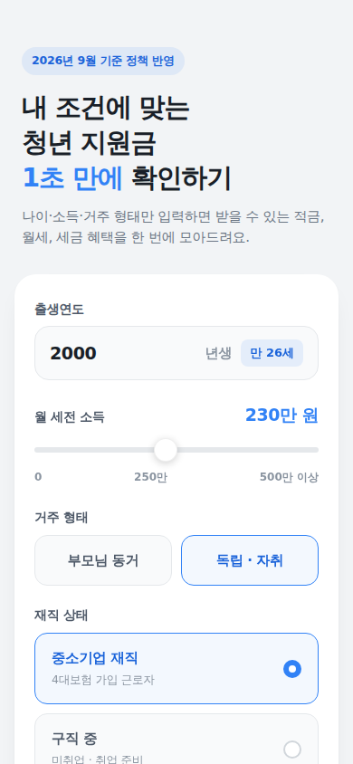

# 청년지원금 계산기

내 조건(나이·소득·거주 형태·재직 상태)만 입력하면 받을 수 있는 청년 적금·월세·세금 혜택을 한 번에 모아 보여주는 모의계산기입니다. Vue 3(Composition API) + Tailwind CSS로 만들었습니다.

[Claude Design](https://claude.ai/design)에서 만든 프로토타입(`design/`)을 실제 실행 가능한 웹앱으로 구현했습니다.

## 화면 흐름

1. **입력** — 출생연도(만 나이 자동 계산), 월 세전 소득 슬라이더, 거주 형태, 재직 상태를 고른 뒤 "맞춤 지원금 확인하기"를 누릅니다.
2. **로딩** — 조건 확인 → 자격 대조 → 수령액 계산 3단계를 보여주며 약 2초간 대기합니다.
3. **결과** — 예상 총 혜택 요약, 매칭된 정책 카드(펼쳐서 자세히 보기 가능), 조건에 맞지 않는 정책과 팁을 보여줍니다. 상단 ‹ 버튼이나 하단 "조건 바꿔서 다시 계산하기"로 입력 화면으로 돌아갈 수 있습니다.

900px 이상 넓은 화면에서는 좌우에 정책 브리핑 레일이 함께 표시됩니다(900px 미만에서는 자동으로 숨겨집니다).

## 스크린샷

| 입력 (모바일) | 로딩 (모바일) |
| --- | --- |
|  |  |

| 결과 (모바일) | 결과 + 좌우 레일 (데스크톱) |
| --- | --- |
|  |  |

## 시작하기

```bash
npm install
npm run dev       # http://localhost:5173 개발 서버
npm run build     # dist/ 에 프로덕션 빌드
npm run preview   # 빌드 결과 미리보기
```

## 프로젝트 구조

```
index.html                          # Vite 엔트리, Pretendard 웹폰트 로드
src/
  main.js                           # 앱 부트스트랩
  App.vue                           # 루트 컴포넌트
  style.css                         # Tailwind 진입점 + 슬라이더 커스텀 스타일
  components/
    YouthGrantCalculator.vue        # 입력 → 로딩 → 결과 3화면 로직/마크업
  data/
    policies.js                     # 정책 데이터 + 매칭 로직
design/                             # Claude Design에서 내보낸 원본 프로토타입(참고용)
  HANDOFF.md                        # 원본 핸드오프 안내문
  chats/                            # 디자인 툴과의 대화 기록
  project/                          # 원본 .dc.html / 프로토타입 에셋
```

## 정책 데이터 수정하기

정책 목록과 매칭 조건은 전부 `src/data/policies.js`의 `POLICIES` 배열에 있습니다. 화면이나 계산 로직은 건드릴 필요 없이 이 배열만 고치면 됩니다.

```js
{
  id: 'future-saving',
  name: '청년미래적금',
  agency: '금융위원회 · 시중 12개 은행',
  icon: '🏦',
  badge: '10월 2차 신청',        // 강조 배지. 없으면 null
  benefit: '3년 만기 시 최대 2,200만 원',
  summary: '...',
  details: ['...', '...'],       // [자세히 보기] 펼침 항목
  monthly: 0,                    // 월 현금성 지원액(원)
  lump: 22_000_000,              // 만기·연간 목돈(원)
  cond: { minAge: 19, maxAge: 34, maxIncomeMan: 300 },
  missMsg: '만 19~34세, 월 세전 소득 300만 원 이하일 때 신청할 수 있어요.',
}
```

- `cond`의 모든 조건은 AND로 평가되며, 필드를 생략하면 해당 조건은 제한하지 않습니다.
- `residence`는 `['parents', 'alone']`, `status`는 `['sme', 'jobseek', 'student']` 중 값을 배열로 넣습니다.
- 예: 10월 청년미래적금 2차 신청이 끝나면 `badge: null`로 바꾸면 됩니다.
- 로딩 화면 문구는 `LOADING_STEPS`, 꿀팁 카드는 `TIPS`, 오른쪽 레일 인기 정책은 `TRENDING`, 서류 체크리스트는 `DOCS`, 왼쪽 레일 지표는 `BRIEFING_STATS`에서 각각 수정할 수 있습니다.
- 만 나이 계산 기준 연도는 `CURRENT_YEAR`이며 매년 갱신이 필요합니다.

## 유의 사항

본 계산기는 UI 목업이며 정책 금액·조건은 예시 데이터입니다. 실제 신청 자격은 각 기관 공고를 확인해야 합니다.
